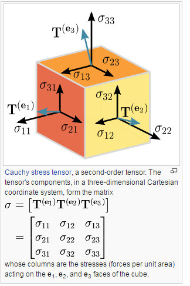

## Tensors
A `Tensor` is the central unit of data in the library. It is a set of numerical values shaped into an array of one or more dimensions. A Tensor instance has a shape attribute (see Shape definition)[] that defines the array shape (i.e., how many values are in each dimension of the array).


The main `Tensor` constructor is the `tf.tensor` function, which takes 2 arguements. The first being our array of data, the second is the shape/dimentions of our array.<br>
Example:
```js
// 2x3 Tensor
const shape = [2, 3]; // 2 rows, 3 columns - This is that shape sttribute we mentioned
const a = tf.tensor([1.0, 2.0, 3.0, 10.0, 20.0, 30.0], shape);
a.print(); // print Tensor values
// Output: [[1 , 2 , 3 ],
//          [10, 20, 30]]

```

Though it is recommended in the docs, that if you are creating low-rank tensors, to use some of the following functions instead, to enhance code readability.
- `tf.scalar`
- `tf.tensor1d`
- `tf.tensor2d`
- `tf.tensor3d`
- `tf.tensor4d`

> See the Tensorflow.js documentation for how these functions behalve.

### What are low-rank tensors?
Before I explain what low-ranking tensors are, I'll frist describe what the word ***Tensor*** actually means.

So in mathamtics a *tensor* is defined as this:<br>
> A mathematical object analogous to but more general than a vector, represented by an array of components that are functions of the coordinates of a space.

So this is simply describing a *tensor* as a mathematical object which refers to  an array of component functions which are represented in space.

For example, a linear map is represented by a matrix (a 2-dimensional array), and therefore is a 2nd-order tensor. A vector is represented as a 1-dimensional array, and is a 1st-order tensor. [Scalars]('../../../mathamatics/terminology.md#scalars') are single numbers and are thus 0th-order tensors.

Here is a example of what a *tensor* could look like:


A very very simply way to look at it is, the dimension of the tensor is called its rank. So a two dimentional tensor would equal to being a rank-2 tensor. Where as a three dimentional tensor would be a rank-3 tensor and so forth.

#### Rank-2 Tensor
This is a two dimentional tensor:
```js
[[1, 4 ],
 [9, 16]]
```

List of ranks:
**Low ranking**
- `rank-0 e.g` [scalar]('../../../mathamatics/terminology.md#scalars') `value`
- `rank-1: e.g a` [vector]('../../../mathamatics/terminology.md#scalars')
- `rank-2: e.g 2 dimentional array`
- `rank-3: e.g 3 dimentional array`
- `rank-4: e.g 4 dimentional array`

**Higher ranking**
- rank-5 and up up up

#### So wait... back to the point what is a low ranking tensor?
Simply a tensor that doesn't have that high of a complexity of layers to it.

Another handy function/s for creating `tensors` is `tf.zeros` || `tf.ones`, which will populate your tensor with values of either `0` or `1` in the shape you desire.
<br>
Example:
```js
// 3 x 5 Tensor with all values set to 0
const zeros = tf.zeros([3, 5]);
// Output: [[0, 0, 0, 0, 0],
//          [0, 0, 0, 0, 0],
//          [0, 0, 0, 0, 0]]
```

One key thing to note is that `tensors` are immutable, which means once you've created their values you can't change them. Instead what you would do is perform operations on them that would generate new `tensors`.

## Variables
Variables are initialized with a `tensor` of values. A key thing to note is that `variables` ARE mutable, which means we can change their values. You can assign a new `tensor` to existing `variables` you've already made, using the `assign` method.
<br>
Here's an exmaple of how we can do that:
```js
const initialValues = tf.zeros([5, 2]);
const biases = tf.variable(initialValues); // initialize biases
biases.print();
// output: 
// [[0, 0, 0, 0, 0],
// [0, 0, 0, 0, 0]]

const updatedValues = tf.ones([5, 2]);
biases.assign(updatedValues); // update values of biases
biases.print();
// output: 
// [[1, 1, 1, 1, 1],
// [1, 1, 1, 1, 1]]
```

> Variables are mainly used to store and update values while you are training your models.
primarily used to store and then update values during model training.

## Operations (Ops)
Operations are what will allow us to manipulate our data which we created in our `tensors`. Most of the built in functions are suitable for linear algebra and machine learning.

Because a `tensor` is immutable, when we perform an `operation` on them, we don't actually change their values, but instead we will be returned a new `tensor`.
<br>
A simple example to demonstrate is the `square()` operation:
```js
const d = tf.tensor2d([2.0, 4.0]);
const d_squared = d.square();
d_squared.print();
// Output:
// [4, 16]
```

`square()` simply goes through each value in the `tensor` and performs our desired operation, which in this case is squaring each value.