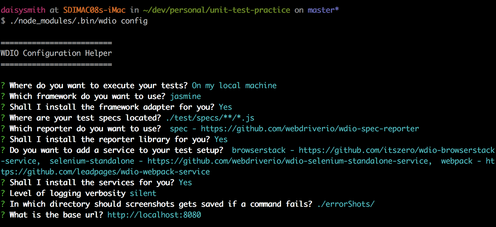

## Setting up a testing environment
This is my example of how to setup a front-end testing environment. For this is be starting with my pre made es6 boilerplate which can be found [here](/).

I won'y cover many details but just what I've used in my build.

#### Modules to install:
Add these modules to your package.json devDependencies
```json
"devDependencies": {
  "jasmine": "^2.5.3",
  "selenium-webdriver": "^3.3.0",
  "wdio-browserstack-service": "^0.1.4",
  "wdio-jasmine-framework": "^0.2.19",
  "wdio-selenium-standalone-service": "0.0.8",
  "wdio-spec-reporter": "0.0.5",
  "wdio-webpack-service": "^1.0.1",
  "webdriverio": "^4.6.2"
}
```

After doing this make sure to run `npm install`

Docs for these packages can be found here:
// TODO: Get links
- [Jasmine](https://jasmine.github.io)
- [Selenium](http://www.seleniumhq.org/)
- [Selenium Standalone](https://github.com/vvo/selenium-standalone)
- [WebdriverIO](http://webdriver.io/)
- [WebdriverIO Jasmine](https://github.com/webdriverio/wdio-jasmine-framework)
- [WebdriverIO Selenium Standalone Service](https://github.com/webdriverio/wdio-selenium-standalone-service)
- [WebdriverIO Spec Reporter](https://github.com/webdriverio/wdio-spec-reporter)
- [WebdriverIO webpack Service](http://webdriver.io/guide/services/webpack.html)
- [BrowserStack](https://www.browserstack.com)
- [WebdriverIO BrowserStack](https://github.com/itszero/wdio-browserstack-service)

After you've installed all of those, you need to first setup [Selenium](http://www.seleniumhq.org/)

#### How to setup Selenium
There are two different ways you can use selenium with your build the way I use it is standalone.<br>
First install [selenium-standalone](https://github.com/vvo/selenium-standalone) globally
```
npm install selenium-standalone@latest -g
```

Next Run:
```
selenium-standalone install
```

#### How to setup WebdriverIO + include BrowserStack settings
run `./node_modules/.bin/wdio config` and follow the prompts to include the items we are using. You can see the list of options chosen in the image below.
<br>



This will now have created a `wdio.conf.js` file

In here you know have to make a few changes to get this all working.

Because you're using BrowserStack you need to go and get your username and access key. You can find this by visiting [this page](/)

To secure this we want to install an npm module called [dotenv](https://www.npmjs.com/package/dotenv):
```
npm install dotenv --save
```

now create a `.env` file in the root of your app.<br>
Next inside this file add this:
```ruby
BROWSER_STACK_USERNAME=your_username_goes_here
BROWSER_STACK_KEY=your_key_goes_here
```

Now inside the `wdio.conf.js` file, you need to add the following:
Put `require('dotenv').config()` at the top of your file above `exports.config = {`

inside the `exports.config` object.<br>
```javascript
require('dotenv').config()

exports.config = {
  host: '0.0.0.0',
  port: 4444,
  path: '/wd/hub',
  browserstackLocal: true,
  user: process.env.BROWSER_STACK_USERNAME,
  key: process.env.BROWSER_STACK_KEY,
  ...
}
```

What we just added was support for BrowserStack to be able to run locally and also included our credentials.

This code is including our `dotenv` file and allows us to call our username and key from a seperate file. It is important that you **DO NOT** push your `.env` file to github. Make sure to add that file to your `.gitignore`.
```js
require('dotenv').config()

exports.config = {
  ...
  user: process.env.BROWSER_STACK_USERNAME,
  key: process.env.BROWSER_STACK_KEY,
  ...
}
```

`browserstackLocal: true` enables BrowserStack to run our local server, while the rest tells it where to view the site. This is BrowserStack's default setup.<br>
Read more [here] and [here](http://webdriver.io/guide/services/browserstack.html)
```js
exports.config = {
  host: '0.0.0.0',
  port: 4444,
  path: '/wd/hub',
  browserstackLocal: true,
  ...
}
```

Next you want to tell BrowserStack what browsers you want  to test.<br>
For this example we'll set it to test:
- The latest Chrome version
- El Capitan, Chrome v56.0, 1024x768
- Yosemite, Safari v8.0, 1024x768

Inside the option capabilities, you can supply an array of objects. Each object describes what system you want to test your app on, theres a list of different options you can set, you can find more [here](https://www.browserstack.com/automate/node#setting-os-and-browser)

```js
exports.config = {
  capabilities: [{
   browserName: 'chrome'
  }, {
  'name': 'chrome',
  'os': 'OS X',
  'os_version': 'El Capitan',
  'browser': 'Chrome',
  'browser_version': '56.0',
  'resolution': '1024x768',
  'browserstack.debug': 'ture'
},{
  'name': 'safari',
  'os': 'OS X',
  'os_version': 'Yosemite',
  'browser': 'Safari',
  'browser_version': '8.0',
  'resolution': '1024x768',
  'browserstack.debug': 'ture'
}],
  ...
}
```


#### How to run your tests
This is assuming you've written a test and placed it inside `/tests/specs/test.js` like we specified in our `wdio.conf.js` file, if you don't have any tests look [here](/js/testing/jasmine.md) for an example test you can use and place it in the right folder.

So to run our tests we have to have our dev server running already (http://localhost:8080).<br>
Next in your `package.json` file add this to scripts:
```json
"scripts": {
    ...
    "test": " ./node_modules/.bin/wdio wdio.conf.js",
  },
```

Now if you run `npm run test` you should see all your tests running and checking if there passing.<br>
