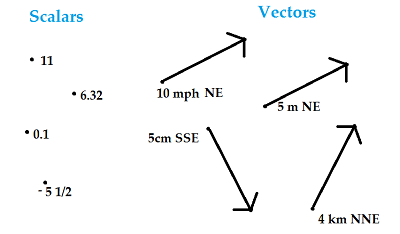
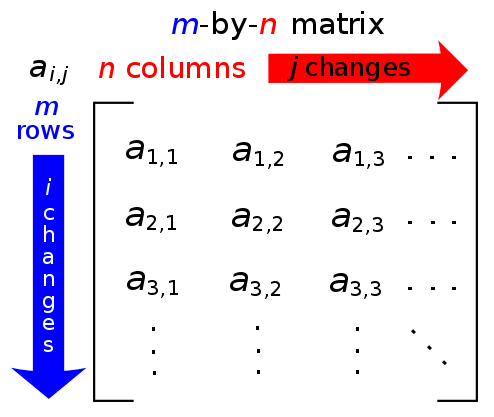

# Collection of mathamatics terms which I've come across in programming

## Scalars
A scalar is an element of a field which is used to define a vector space. A quantity described by multiple scalars, such as having both direction and magnitude, is called a vector.

 - A scalar is a **single number** that is used to measure magnitude (size).
 - Scalars have magnitude or a numerical value, and **not direction**.
- They are the opposite of vectors, which have both a magnitude (or numerical value) and a direction.

Difference between the two:<br>
### Examples of scalars: 
- `10 m`
- `100 degrees F`
- `222 K/cal`

### Examples of vectors:
- `5 m/sec, North;`
- `10 miles, West;`



## Matrix
A matrix (plural: matrices) is a rectangular array of numbers, symbols, or expressions, arranged in rows and columns. 

Mathamatical diagram of a matrix:


Javascript example:<br>
The dimensions of the matrix below are 2 × 3, because there are two rows and three columns:
```js
[
  [1, 2, 3],
  [1, 2, 3],
]
```
