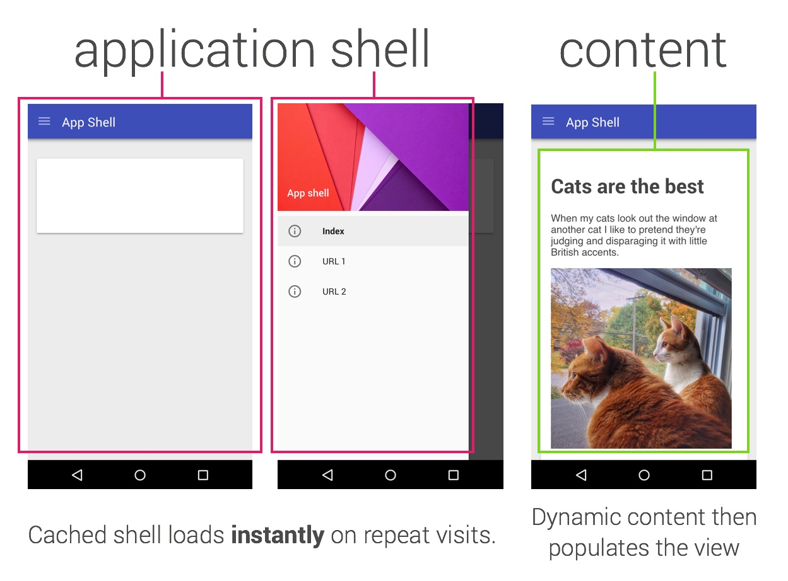
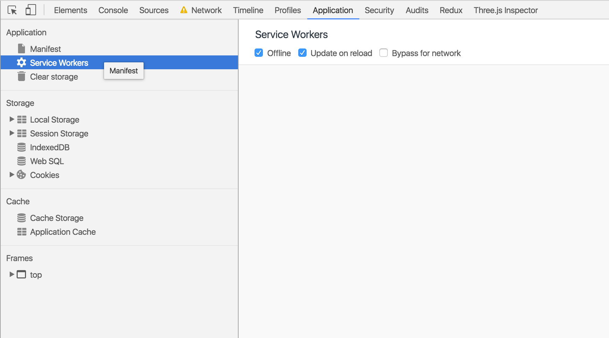

#Progressive Web Apps Training
This was a training session provided by Google Developers to teach companies how to use progressive web apps.
This course usually goes for three days, however we attended the course for two days. Where they covered a range of different topics, about how to think and structure building progressive web apps and how to also implement these techniques. The workshops were 40% hands on lab exercises.

## Contents
- [x] [Introduction to Progressive Web Apps](#introduction-to-progressive-web-apps)<br>
- [x] [New techniques for responsive design (with lab)](#new-techniques-for-responsive-design)<br>
- [x] [Working with Responsive Images (with lab)](#working-with-responsive-images)<br>
- [x] [Introduction to Service Workers](#introduction-to-service-workers)<br>
- [ ] [Adding offline support for an existing content site (with lab)](#)<br>
- [ ] [Designing PWA support for dynamic sites & web apps](#)<br>
- [x] [Auditing an existing site with Lighthouse (with lab)](#auditing-an-existing-site-with-lighthouse)<br>
- [ ] [Using sw-toolbox and sw-precache to automate Service Worker creation (with lab)](#)<br>
- [x] [Deeper dive into core technologies (Promises, Fetch API, Cache API)](#caching-and-return-requests)<br>
- [ ] [Working with Indexed DB (with lab)](#)<br>
- [ ] [Building apps that cache live data in the service worker](#)<br>
- [ ] [Discoverability & Analytics](#)<br>

## Introduction to Progressive Web Apps
By definition Progressive Web Apps are user experiences that have the reach of the web, and are:
- **Reliable** - Load instantly and never show the downasaur, even in uncertain network conditions.
- **Fast** - Respond quickly to user interactions with silky smooth animations and no janky scrolling.
- **Engaging** - Feel like a natural app on the device, with an immersive user experience.

This new level of of quality allows Progressive Web Apps to earn a place on the user's home screen.


## New techniques for responsive design
**Set the Viewport**<br>
 A meta viewport tag gives the browser instructions on how to control the page's dimensions and scaling.

 A basic example of using responsive design techniques can be found [here](https://github.com/daisymarie128/pwa-training-labs/tree/master/responsive-design-lab/app)
 - Clone the repo
 - Start a local server and navigate to the appropriate local host port (e.g http://localhost:8080/)
 - Resize your window and see how the columns change.

Use the meta viewport tag to control the width and scaling of the browser's viewport.<br>
Include width=device-width to match the screen's width in device-independent pixels.<br>
Include initial-scale=1 to establish a 1:1 relationship between CSS pixels and device-in§dependent pixels.<br>
```html
<meta name="viewport" content="width=device-width, initial-scale=1">
```

**Use media queries**<br>
Use media queries!
```css
@media (min-width: 500px) and (max-width: 600px) {
    h1 {
      color: red;
    }
  }
 ```
How to choose breakpoints:
Don't base breakpoints on devices, products, brand names, or operating systems that are in use today. This will become annoying to maintain.<br>
Instead:
- Design based on content.
- Design for the smallest mobile device first; then progressively enhance the experience as more screen real estate becomes available.
- Keep lines of text to a maximum of around 70 or 80 characters.
- Keep in mind you don't want to end up with to many break points – safe to have about 3 (but this depends on what your site needs)

**Pointers and Hovers**<br>
 Use `any-pointer` and `any-hover`. They are similar to `pointer` and `hover` but instead allow you to target all pointer devices rather than just the primary pointer device.

 **Relative Units**<br>
 Use relative units!<br>
 Using relative units for measurements can help simplify layouts and prevent accidental creation of components that are too big for the viewport.

 ***Don't do***
 ```css
.fullWidth {
  width: 320px;
  margin-left: auto;
  margin-right: auto;
}
 ```
 ***Instead Use***
 ```css
.fullWidth {
   width: 100%;
 }
 ```

 **Forms**<br>
 Providing autocomplete functionality on your forms is an important UX feature that helps users get through your site quicker.<br>
 It's as simple as adding an `autocomplete` tag to your form.<br>
 ```html
 <label for="frmNameA">Name</label>
<input type="text" name="name" id="frmNameA"
  placeholder="Full name" required autocomplete="name">

<label for="frmEmailA">Email</label>
<input type="email" name="email" id="frmEmailA"
  placeholder="name@example.com" required autocomplete="email">

<label for="frmPhoneNumA">Phone</label>
<input type="tel" name="phone" id="frmPhoneNumA"
  placeholder="+1-555-555-1212" required autocomplete="tel">
 ```

A list of fields can be found [here](https://developers.google.com/web/fundamentals/design-and-ui/input/forms/#use_metadata_to_enable_auto-complete)


## Auditing an existing site with Lighthouse
[**Get Lighthouse**](https://developers.google.com/web/tools/lighthouse/)<br>
Lighthouse is a tool for auditing an app for PWA features and checking your app meets a respectable bar for web performance under emulated mobile conditions.<br>
> Lighthouse can be run as a Chrome Extension, from the command line, or used programmatically as a Node module.

A basic example of using responsive design techniques can be found [here](https://github.com/daisymarie128/pwa-training-labs/tree/master/lighthouse-lab/app)
- Clone the repo
- Start a local server and navigate to the appropriate local host port (e.g http://localhost:8080/)
- Run the lighthouse extension and see the results you get.


## App Shell
The app's shell is the minimal HTML, CSS, and JavaScript that is required to power the user interface. Its first load should be extremely quick and immediately cached, it should be loaded once over the network and then saved to the local device. Next time the user comes to the site on their device the files are loaded from their cache and start-up time should be extremely fast now.<br>
The shell architecture should separate the core application infrastructure and UI from the data. The shell is cached using a service worker, so that on future loads the app only has to retrieve the relevant data rather than reloading everything.

Designing your app using the shell allows you to focus on speed and gives you similar properties to native apps: instant loading and regular updates, all without the need of an app store.

> example of what the shell should be



##### Design tips for a shell
First break the site down to its core components.
1. What needs to be on the screen immediately
2. Key UI components of the app
3. Which supporting resources are needed. For example images, JavaScript, styles, etc.

When designing a more complex app, content that isn't needed for the initial load can be requested later and then cached for future use.

## Introduction to Service Workers
A service worker is a script that your browser runs in the background, separate from a web page, opening the door to features that don't need a web page or user interaction.<br>

It is a programmable network proxy, allowing you to control how network requests from your page are handled.

##### Features
Intercept network requests<br>
Requests caching<br>
Push notifications<br>
Background sync (proposed)<br>
Geo-fencing (proposed)

A working example of a site using a service worker can be found [here](https://github.com/daisymarie128/pwa-training-labs/tree/master/cache-api-lab/app)
- Clone the repo
- Start a local server and navigate to the appropriate local host port (e.g http://localhost:8080/)
- Open up Chrome DevTools
- Go to the Application tab
- Read instructions below on how to see your service worker.

#### Registering
***Example of how to register your service worker***

```javascript

navigator.serviceWorker.register('service-worker.js').then(function(registration) {
  console.log('registered!', registration)
});
```

***Example of event handlers***

```javascript
self.addEventListener('install', event => {
  console.log('installed!', event);
});

self.addEventListener('activate', event => {
  console.log('activated!', event);
});

self.addEventListener('fetch', event => {
  console.log('fetched!', event.request.url, event);
});
```

It is important to put this file in the root of your site, so that it can act on any requests to your domain. For example if you put it in `/js/service-worker.js` then it would only be able to act on requests mad to `/js`

It's also important to wrap this with a check to see if the browser supports service workers, currently ios doesn't.

```javascript
if ('serviceWorker' in navigator) {

}
```

**How to test if your service worker is there:**<br>
In Chrome you can do this by<br>
***opening DevTools -> Click on "Application" -> Check for registered ServiceWorker***.<br>
You should be able to find `service-worker.js` (or whatever you named your file).

#### Installing
After you've registered the service worker, the browser will now install it and activate it. <br>
The script will be installed in the user’s browser and it will live there even after the user has left your site.

When it's installed ***see the event handler above***, is when you should begin to cache your files.<br>
The cache can be accessed by: `caches.open(CACHE_NAME)`

You need to specify the name of the cache you want to use. This usually includes the version number, so you can use a new cache for the updated resources when you release a new version.

The method will return a promise, which resolves to the cache object. You can use this cache object to add the files you want to cache. The `addAll` method takes in an array of URLs, retrieves them, and adds the responses to the cache.

It's good to wrap the cache call with a Promise that resolves when everything you want to do in the install event is done. If not, the worker will be marked as installed and will be activated before it is ready. To do this put the `caches.open` chain into `event.waitUntil`:
```javascript
self.addEventListener('install', event => {
  console.log('installed!', event);
  event.waitUntil(
    caches.open(CACHE_NAME)
    .then(function (cache) {
      //...
    })
  );
});
```

**How to test if your files are cached**<br>
In Chrome DevTools:<br>
***Open up DevTools -> Application tab -> CacheStorage***

You should see that all the files in URLs list are in the CACHE_NAME (whatever you named it) cache.

#### Caching and Return requests
Even though you've now cached our files, you now need to tell your application to use them when a user comes back to your site. To do this we need to use the `fetch event`. This is what you will call to fetch the files you have just cached.

The fetch event makes it possible to intercept every HTTP request the browser does from the page where you attached the ServiceWorker.<br>
`fetch()` is a built in function for doing network requests. It is able to take another request and perform it.

What you want to do, is be able to look at your cache and check if the files are already cached and then return them. – you use `caches.match` to check this.<br>
`caches.match` will check all the caches for a file with the given URL. It returns a Promise with the response from the cache. If the cache contains what you are looking for it will be a response object.<br>
And if there is no file in the cache, you simply clone the original request and send it to fetch. Then, you return the Promise that you get from fetch.

***Example of a fetch request***

```javascript
self.addEventListener('fetch', function(event) {
  event.respondWith(
    caches.match(event.request)
      .then(function(response) {
        // Cache hit - return response
        if (response) {
          return response;
        }

        // Clone the request. A request is a stream and
        // can only be consumed once.
        // You are consuming this by cache and once by the browser
        // for fetch. - this is why we need to clone.
        var fetchRequest = event.request.clone();

        return fetch(fetchRequest).then(
          function(response) {
            // Check if we received a valid response
            if(!response || response.status !== 200 || response.type !== 'basic') {
              return response;
            }

            var responseToCache = response.clone();
            caches.open(CACHE_NAME)
              .then(function(cache) {
                cache.put(event.request, responseToCache);
              });

            return response;
          }
        );
      })
    );
});
```
**How to test your site offline**<br>
***open DevTools -> Click on "Application" -> Service Workers***<br>
Then toggle the offline checkbox.<br>


#### Updating
At some stage your service worker will need to be updated.<br>
If you've updated your service worker file the browser now considers this to be new and will redownload it. Your service worked will be started and the install event will be fired.<br>
However at this stage the old service worker is still controlling the he current pages so the new service worker will enter a waiting state.<br>
Only after the currently open pages of your site are closed, will your new service worker take control and your older version be killed. After that then the new activate event will be fired.

The activate function usually has a task that will handle cache management. <br>
Reason for doing this in the `activate` event and not the `install` event is to avoid removing old caches that an older service worker may be using.

```javascript
self.addEventListener('activate', function(event) {

  var cacheWhitelist = ['cache-v1', 'cache-other-v1'];

  event.waitUntil(
    caches.keys().then(function(cacheNames) {
      return Promise.all(
        cacheNames.map(function(cacheName) {
          if (cacheWhitelist.indexOf(cacheName) === -1) {
            return caches.delete(cacheName);
          }
        })
      );
    })
  );
});
```
#### Things to be mindful of
Service workers are relatively new and there are still a few gotchas worth remembering, which you should read [here](https://developers.google.com/web/fundamentals/getting-started/primers/service-workers#rough_edges_and_gotchas)


## Working with Responsive Images
Images account for more than 60% of the bytes on average needed to load a web page.<br>
Here are some checklists to optimize image performance:

- Use relative sizes for images to prevent them from accidentally overflowing the container.<br>
- Use the `picture` element when you want to specify different images depending on device characteristics (a.k.a. art direction).<br>
- Use `srcset` and the `x` descriptor in the `img` element to give hints to the browser about the best image to use when choosing from different densities.<br>
- If your page only has one or two images and these are not used elsewhere on your site, consider using inline images to reduce file requests.

A working example of using responsive images can be found [here](https://github.com/daisymarie128/pwa-training-labs/tree/master/responsive-images-lab)
- Clone the repo
- Start a local server and navigate to the appropriate local host port (e.g http://localhost:8080/)
- Open up Chrome DevTools
- Go to the Networks tab
- Resize your window and watch the different files get loaded depending on the viewport.

**Relative Image Sizes**
Use relative width sizes depending on the parents container, bot the viewport. i.e `width: 50%`.<br>
Because CSS allows content to overflow its container, you may need to use max-width: 100% to prevent images and other content from overflowing. For example:
```css
img, embed, object, video {
  max-width: 100%;
}
```

Also remember to use meaningful descriptions on the `alt` tag.

**Enhance images with srcset**
The `srcset` attribute enhances the behavior of the `img` element, making it easy to provide multiple image files for different device characteristics. <br>
`srcset` allows the browser to choose the best image depending on the characteristics of the device.<br>
```html

```

If a browser doesn't support the `srcset` attribute, then the default `src` image will be used.<br>
When `srcset` is supported, the comma-separated list of image/conditions is parsed prior to making any requests, and only the most appropriate image is downloaded and displayed.

Use the `picture` element when an image source exists in multiple densities, or when a responsive design dictates a somewhat different image on some types of screens.
```html
<picture>
  <source media="(min-width: 800px)" srcset="image.jpg, image-2x.jpg 2x">
  <source media="(min-width: 450px)" srcset="image-small.jpg, image-small-2x.jpg 2x">
  
</picture>
```

The above code snippet shows how you can include different source images for different screen widths. It's also important to note that the default `img` is set for any device widths smaller than `450px`.

**Relative sized images**
Instead of supplying fixed image sizes and densities, you can specify the size of each supplied image by adding a width descriptor along with the size of the image element.<br>
The browser will automatically calculate the effective pixel density and choose the best image to download.<br>
This example renders an image that is half the viewport width `(sizes="50vw")`, and depending on the width of the browser and its device pixel ratio, allows the browser to choose the correct image regardless of how large the browser window is.
```html

```

You can also set multiple sizes:
```html

```

## IndexedDB
IndexedDB is a low-level API for client-side storage of significant amounts of structured data, including files/blobs and is a JavaScript-based object-oriented database.<br>
It lets you store and retrieve objects that are indexed with a key; any objects supported by the structured clone algorithm can be stored.<br>
In order to use IndexedDB you need to:<br>
***specify the database schema -> open a connection to your database -> retrieve and update data within a series of transactions***

#### Storage
Firefox: no limits, but will prompt after 50MB data stored. Mobile Safari: 50MB max, Desktop Safari: unlimited (prompts after 5MB), IE10+ maxes at 250MB and prompts at 10MB.<br>

First Header | Second Header
------------ | -------------
Content from cell 1 | Content from cell 2
Content in the first column | Content in the second column

<!-- | Default                | Firefox                                           | Mobile Safari | Desktop Safari                     | IE10+                                   |
| ----------------------|-------------------------------------------------| -------------| ----------------------------------| ---------------------------------------|
| 50% of free disk space | no limits, but will prompt after 50MB data stored | 50MB max      | unlimited (prompts after 5MB)      | maxes at 250MB and prompts at 10MB      | -->

#### Basic Implementation
```js
// open our database
const request = window.indexedDB.open("yourDatabase", 3);
```

The `open()` function returns an `IDBOpenDBRequest` object with a result (success) or error.<br>
The second parameter (in this case `3`) is the version of the database. The version of the database determines the database schema — the object stores in the database and their structure.<br>
> Note: Don't use floats for this number as it will be rounded to the nearest int

```js
request.onsuccess = (event) => {
  db = event.target.result;
};
```

`request.result` is an instance of `IDBDatabase` and it's important to save this to use later.

#### Structuring the database
IndexedDB uses object stores rather than tables, and a single database can contain any number of object stores. Values are always associated with a key.

```js
request.onupgradeneeded = function(event) {
  const db = event.target.result;

  // Create an objectStore to hold information about our contacts.
  const objectStore = db.createObjectStore('contacts', {keyPath: 'id'});

  // Create an index to search contacts by name. We may have duplicates
  // so we can't use a unique index.
  objectStore.createIndex("name", "name", { unique: false });
  objectStore.createIndex("email", "email", { unique: true });

  // Use transaction oncomplete to make sure the objectStore creation is
  // finished before adding data into it.
  objectStore.transaction.oncomplete = (event) => {
    // Store values in the newly created objectStore.
    let contactsObjectStore = db.transaction("contacts", "readwrite").objectStore("contacts");
    for (var i in ourData) {
      contactsObjectStore.add(ourData[i]);
    }
  };
};
```
Read more on IndexedDB [here](https://developer.mozilla.org/en/docs/Web/API/IndexedDB_API)
