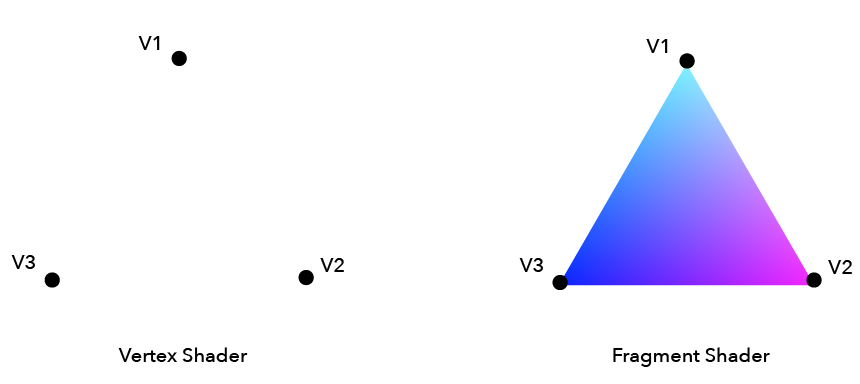
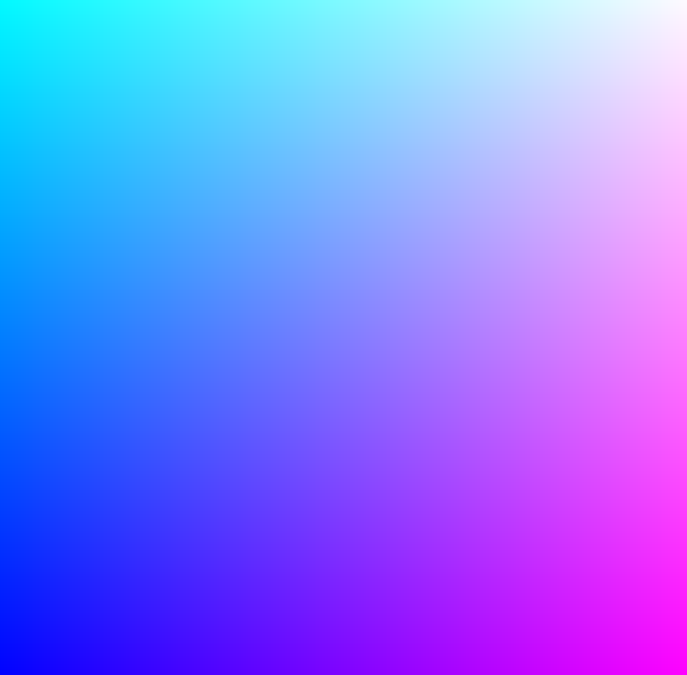
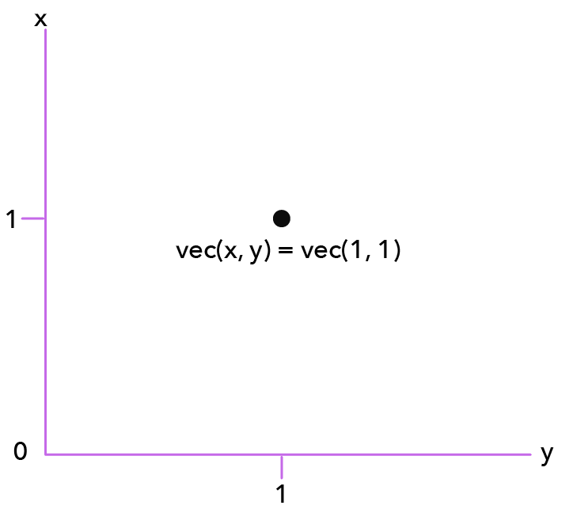

## Shaders
Shaders are small scripts which are written in the OpenGL Shading Language (GLSL), which is a language similar to C/C++. These scripts are processed on your GPU instead of you CPU which makes their performance for graphics extremely fast. Using a shader can speed up your app significantly.

Shaders are run once per pixel that is on screen, which is usually always an extremely large number. The reason why shaders are so performant is because they draw many pixels in parallel (i.e. at the same time). But because of this, the shaders can only work on a single pixel at a time, and they don't access to the values of any other pixels.

There are two types on shaders:<br>
[Vertex Shader](#vertex)<br>
[Fragment Shader](#fragment)

<!-- TODO: update this -->
#### Vertex
Vertex shaders are typically used to tell the GPU where to draw/place things in a 2D or 3D space.
Consider it like this:<br>
Take a standard sphere. Its made up of many vertices (depending on the detail more). A vertex shader takes these points and manipulates them (moves them etc - this is how you can animate with a shader).<brb>

Vertex shaders have one main responsibility - it MUST at some point set something called `gl_Position` (a 4d float vector - this is the final position of the vertex on screen).

#### Fragment
Fragment shaders are typically used to output the pixel colors of the vertex shader. They handle things to do with texture, lighting and color.

Its one MUST do job is: set or discard the `gl_FragColor` variable, another 4D float vector - which is the final color of our fragment.<br>
Now imagine a fragment like this:<br>
A triangle – and it reads its three vertices which it is made up of. And now each pixel in the triangle needs to be drawn out. A fragment is the data provided by these 3 vertices in order to color the triangle. So if one vertex was red and another blue - you would get a gradient from red - purple - blue.

***Example of what the shaders compute***<br>


#### Shader Variables
There are three declarations you can make using shaders.<br>

 UNIFORMS                                                    | ATTRIBUTES                             | VARYINGS                                                                    |
:----------------------------------------------------------- |:-------------------------------------- |:--------------------------------------------------------------------------- |
Sent to both shaders                                         |Applied to individual vertices          |Declared in the vertex shader BUT want to be shared with the fragment shader |
Value that stays the same across entire frame being rendered |Only available to the vertex shader     |Processed in the vertex shader first                                         |
Values which are passed from the CPU to the GPU              |One to one relation ship with vertices  |Fragment shader receives interpolated data                                   |


This is an example of a basic fragment shader:
```glsl
precision highp float;
varying vec2 vUv;

void main () {
  gl_FragColor = vec4(vUv.xy, 1.0, 1.0);
}
```
***result:***<br>


#### Data Types & Syntax
Heres a list of different data types you can use:<br>
`float` - a simple float value, e.g. 1.0<br>
`int` - an integer, e.g. `1`<br>
`vec2` - a vector with 2 floats, e.g. `vec2(x, y)`<br>
`vec3` - a vector with 3 floats, e.g. `vec3(x, y, z)` or `vec3(r, g, b)`<br>
`vec4` - a vector with 4 floats, e.g. `vec4(r, g, b, a)`<br>
`sampler2D` - a special type which deals with texture/image sampling.

These types are very strict, sometimes you may get errors because you've declared `float number = 1;` this will error because it is expecting `float number = 1.0;`

A vector is simply a point in space, which is sometimes depicted using arrows. Because vectors usually have a direction. That is usually how you would calculate the distance from points. A vector is made up of at least 2 or more numbers. So a vertex is a point where two or more straight lines meet, like a corner. This value will be made up of 2 or 3 values (depending on 2D or 3D representation) and you can think of these as coordinates for where that vertex is.

For example 2D coordinates would be:<br>
```js
vertex = vec2(x, y);
```

3D coordinants would be:<br>
```js
vertex = vec3(x, y, z);
```
***example of vertex coordinates***<br>


You can also access values from data you've created like so:
```glsl
vec3 red = vec3(1.0, 0.0, 0.0);

void main() {
  gl_FragColor = vec4(red.r, red.g, red.b, 1.0);
}
```

***Example of declaring colors***
```glsl
vec3 red = vec3(1.0, 0.0, 0.0);
vec3 green = vec3(0.0, 1.0, 0.0);
vec3 blue = vec3(0.0, 0.0, 1.0);

void main() {
  gl_FragColor = vec4(green, 1.0);
}
```
