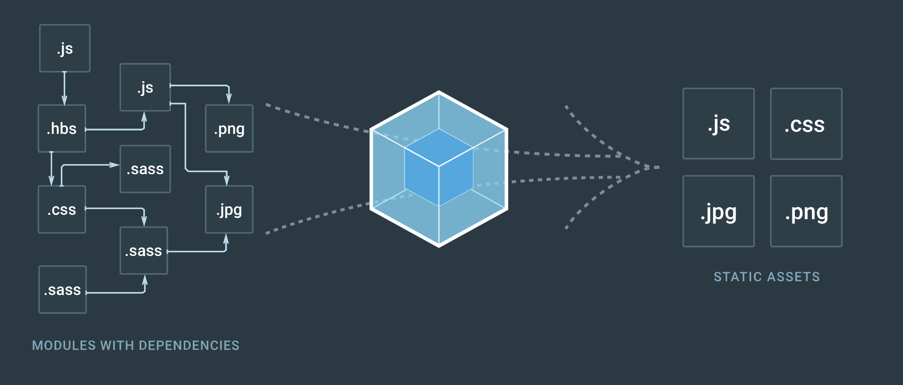

## Webpack
Webpack is simply a module bundler for modern JavaScript applications. The webpack site has some good information about key concepts to get started, you can find them [here](https://webpack.js.org/concepts/)




Webpack is very configurable, so there are many different ways you can set it up. This is how I like to set up mine for basic usage.
***Note: This is an example using webpack 2***

#### Entry point
One of the first things you need to do is setup and entry point. The entry point tells webpack where to start and follows the graph of dependencies to know what to bundle.<br>
You can also specify the entry point as either a string, array or an object. The difference between when to use each depends but basically if you wanted to have multiple html pages with different code bundles for each you should use an object. For a single page application you could just use a sting.<br>

A rule to follow is:<br>
One entry point per HTML page.
Single Page Applications: one entry point
Multi Page Application: multiple entry points.

*Example of single page*
```js
module.exports = {
	entry: {
		'index': [
			'./app/index.js', './app/index.scss'
		]
	}
};
```

*Example of multi page*
```js
module.exports = {
	entry: {
		'index': [
			'./app/index.js', './app/index.scss'
		],
		'page2': [
			'./app/page2/index.js', './app/page2/index.scss'
		]
	}
};
```

In the examples above you'll also notice I've included a .js file path and .scss file path in an array for each. What this is doing is telling webpack to run multiple compilers, while still sharing internal resources such as file watchers for efficiency. This will bundle that scss file with the javascript.

However you should require your styles in your javascript using:
```js
import './index.scss';
```

So in webpack you could just write:
```js
module.exports = {
	entry: {
		'index': './app/index.js',
		'page2': './app/page2/index.js'
	}
};
```

#### Output
The next thing you need to set is an output path. This will instruct webpack on how and where it should output your bundles, assets and anything else you bundle or load with webpack.<br>
The two main keys to be set for your output are the `path` and `filename`. Both very self explanatory of what they do. `Path` will be where webpack puts your bundled files and `filename` will be what webpack will name these files.
```js
...
output: {
  path: `${__dirname}/dist`,
  filename: 'js/[name].js'
},
```

#### Modules
These options determine how the different types of modules within a project will be treated.<br>
`module.rules`
An array of Rules which are matched to requests when modules are created. These rules can modify how the module is created. They can apply loaders to the module, or modify the parser. You can read more on this [here](https://webpack.js.org/configuration/module/#module-rules)

Inside the modules object we want to specify some loaders which we will need to process of transpile some of our code. In webpack2 this is included inside rules. A loader can refer to a preprocessor such as Sass, or a transpiler such as Babel.<br>

If we wanted to use ES6 via Babel in our project, we’d first install the appropriate loaders locally:<br>
```
npm install babel-loader babel-core babel-preset-es2015 webpack --save-dev
```

test: Tells webpack which files to run this on.<br>
exclude: Which files to ignore, you usually want to include node modules or third party libraries you're using.<br>
loader: The module which you installed using npm, which we do the work on these files.

It's important to read the docs for each loader you use as they might have different settings needed.

***Example of module rules/loaders***
```js
...
module: {
  rules: [
    {
      test: /\.js$/,
      exclude: /node_modules/,
      loader: 'babel-loader'
    }, {
      test: /\.scss$/,
      use: ['style-loader', 'css-loader', 'sass-loader']
    }, {
      test: /\.jpe?g$|\.gif$|\.png$/i,
      loader: 'file-loader?regExp=(image.*)&name=[1]'
    }
  ]
},
```

***All the code together***<br>
```js
const HTMLWebpackPlugin = require('html-webpack-plugin');
const CopyWebpackPlugin = require('copy-webpack-plugin');
const	HTMLWebpackPluginConfig = new HTMLWebpackPlugin({
			inject: 'body',
			template: `${__dirname}/app/index.html`,
			filename: 'index.html',
			chunks: ['index']
		})

module.exports = {
	entry: {
		'index': './app/index.js',
		'page2': './app/page2/index.js'
	},
	output: {
		path: `${__dirname}/dist`,
		filename: 'js/[name].js'
	},
	module: {
		rules: [
			{
				test: /\.js$/,
				exclude: /node_modules/,
				loader: 'babel-loader'
			}, {
				test: /\.scss$/,
				use: ['style-loader', 'css-loader', 'sass-loader']
			}, {
				test: /\.jpe?g$|\.gif$|\.png$/i,
				loader: 'file-loader?regExp=(image.*)&name=[1]'
			}
		]
	},
	plugins: [
		HTMLWebpackPluginConfig
	]
};

```
